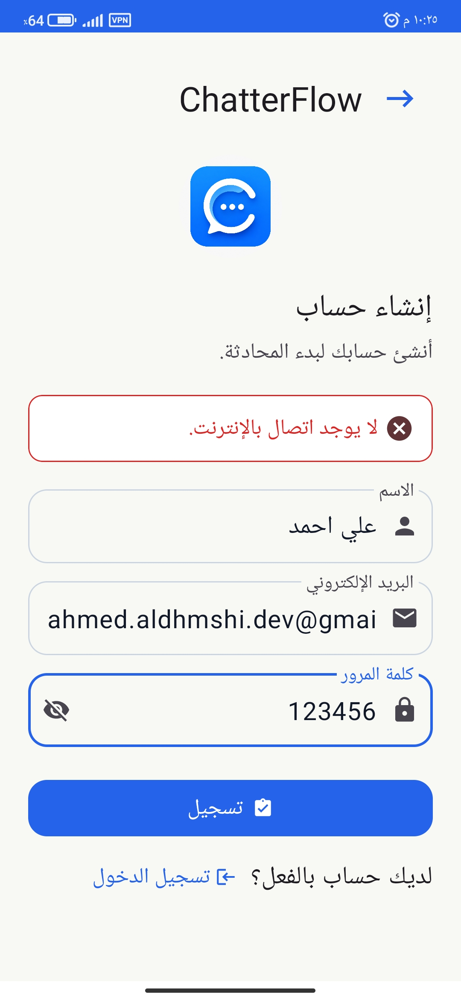
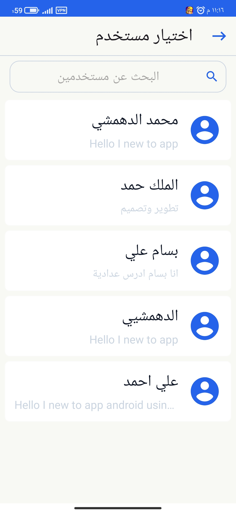
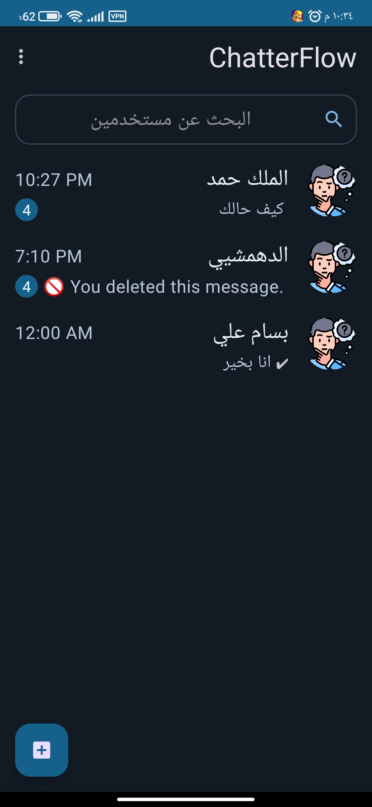
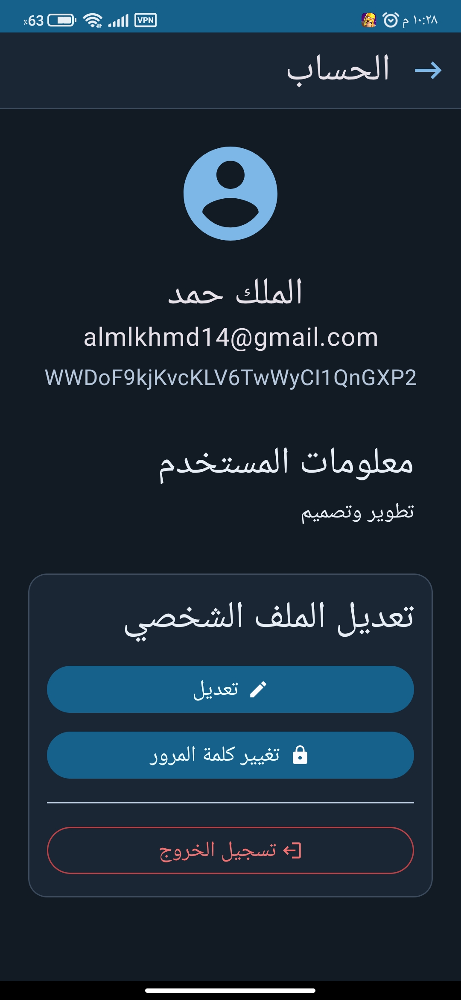
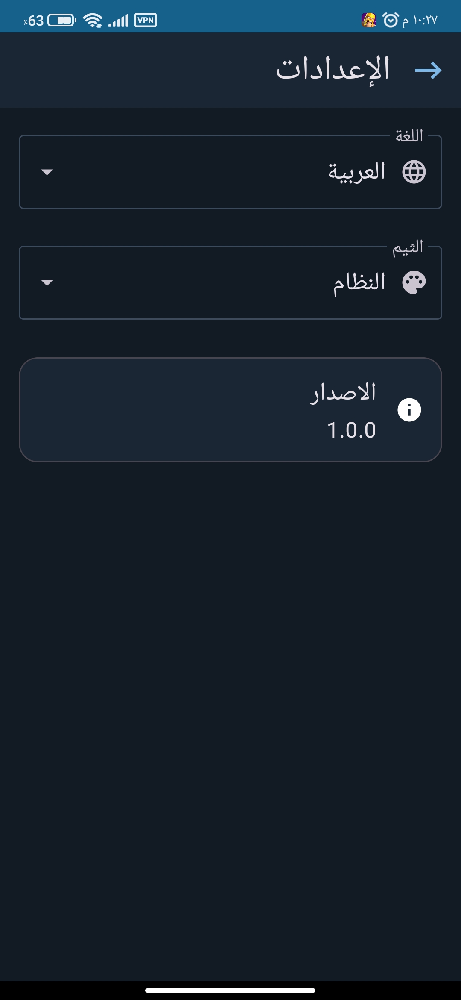
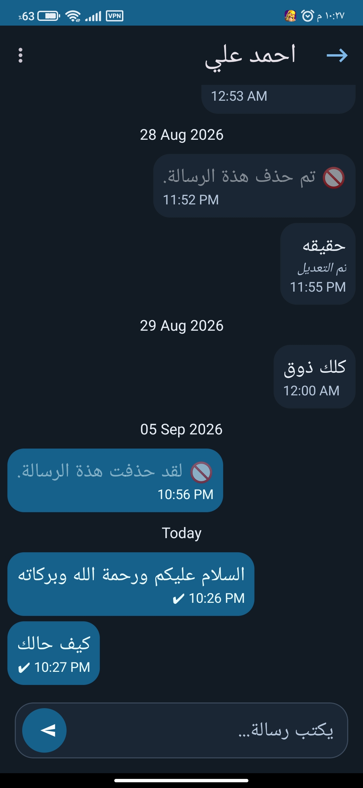

# ChatterFlow Android

<div align="center">


</div>

ChatterFlow is a real-time one-to-one messaging application for Android, built with Kotlin and Firebase.

The project was developed to practice building a complete Android application with user authentication, real-time messaging, message status tracking, account management, and application settings.

## Screenshots

### Authentication

<p align="center">
  
  
</p>

### Users and Chat

<p align="center">
  
  
</p>

### Account and Settings

<p align="center">
  
  
</p>

### Message Actions

<p align="center">
  
</p>

## Features

### Authentication

* User registration and login
* Firebase Authentication
* Session management
* Logout
* Authentication error handling

### User and Chat Management

* Display registered users
* Search users
* Start one-to-one conversations
* Deterministic chat IDs for user pairs
* Display the last message in the chat list
* Unread message counters

### Messaging

* Send and receive messages in real time
* Message timestamps
* Date separators
* Edit messages
* Delete messages
* Copy message content
* Long-press message actions
* Sent, delivered, and seen message states
* Typing indicator

### Account Management

* View current user information
* Edit name and bio
* Change password
* Re-authentication before changing the password
* Account logout

### Application Settings

* Arabic and English language support
* Light and dark themes
* System theme support

<<div align="center"><h2>Download APK</h2><p>
Download and try the latest APK version of ChatterFlow.
</p><a href="https://drive.google.com/file/d/1ik90zePMXKlf1uyM5PjgALP7ASfoOx0K/view?usp=drivesdk">
  
</a></div>


## Tech Stack

| Technology              | Usage                                    |
| ----------------------- | ---------------------------------------- |
| Kotlin                  | Primary programming language             |
| XML                     | UI layouts                               |
| Android SDK             | Application platform                     |
| Firebase Authentication | User authentication                      |
| Cloud Firestore         | Real-time application data and messaging |
| Kotlin Coroutines       | Asynchronous operations                  |
| StateFlow               | UI state management                      |
| Navigation Component    | Fragment navigation                      |
| ViewBinding             | View access                              |
| Material 3              | UI components and theming                |
| MVVM                    | Application architecture                 |

## Architecture

ChatterFlow follows the MVVM architecture pattern and separates responsibilities between the UI, ViewModel, application operations, and data access.

The main application flow is organized around:

* Activities and Fragments for the UI
* ViewModels for UI state and user interactions
* Use Cases for application operations
* Repositories for data access
* Mappers for converting between data and application models

Kotlin Coroutines are used for asynchronous operations, while `StateFlow` is used to expose and observe UI state.

## Project Structure

The project is organized into feature and responsibility-based packages:

```text
com.example.chatapp
│
├── a_application
├── a_authentication
├── b_user_list
├── c_listChatUser
├── d_chat_Document
├── e_messageChatId
├── mapper
├── utils
└── MainActivity
```

The feature packages contain the components related to their respective application areas, while shared functionality is kept in `mapper` and `utils`.

## Firebase

ChatterFlow uses Firebase for authentication and real-time application data.

### Firebase Authentication

Firebase Authentication is used for:

* User registration
* Login
* Session management
* Password changes
* Re-authentication

### Cloud Firestore

Cloud Firestore is used for application data that needs to be synchronized in real time, including:

* User profiles
* Chat documents
* Messages
* Message status
* Typing indicators
* Unread message information
* Last message information

Firestore snapshot listeners are used to observe real-time changes where required by the application.

## Error Handling

Firebase and application errors are mapped to application-specific error types before reaching the UI.

This keeps data-source-specific error handling separated from the presentation layer and allows the UI to display appropriate messages for different operations.

## Getting Started

### Requirements

* Android Studio
* Android SDK
* Kotlin
* A Firebase project

### Setup

1. Clone the repository.

```bash
git clone https://github.com/ahmedaldhmshidev-art/ChatterFlow-Android.git
```

2. Open the project in Android Studio.

3. Create or select a Firebase project.

4. Add the Firebase configuration file to the Android application.

5. Enable Firebase Authentication.

6. Enable Cloud Firestore.

7. Build and run the application on an Android device or emulator.

## Project Status

ChatterFlow is a completed personal Android project and represents the current stable version of the application.

The current version includes authentication, user management, real-time one-to-one messaging, message management, account management, application settings, and Firebase integration.

## Author

Ahmed Ali Aldhmshi

GitHub: [ahmedaldhmshidev-art](https://github.com/ahmedaldhmshidev-art)
